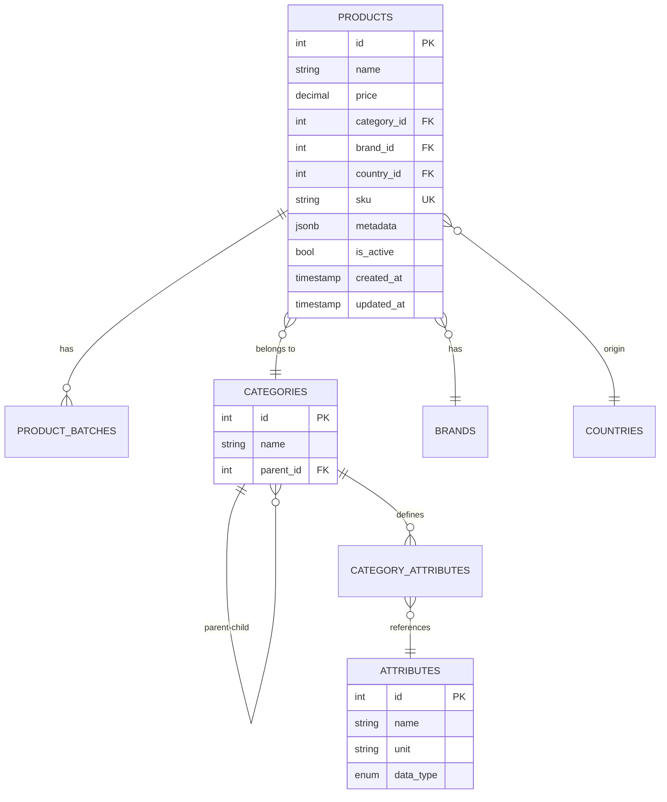

## Database Overview

The GroceryStore API uses **PostgreSQL** as its primary database, leveraging advanced features like:

- **JSONB** for flexible product metadata
- **Recursive queries** for category hierarchies
- **Foreign key constraints** with restrict delete behavior
- **Soft deletion** via `is_active` flags
- **Snake_case naming** convention

<Note>
  The database is pre-seeded with production-ready categories (Dairy, Alcohol, Meat, etc.) and product attributes (Fat Content, Volume, Alcohol %, etc.).
</Note>

## Entity Relationship Diagram



## Core Entities

### Product Entity

The central entity representing a grocery product:

```csharp GroceryStore/Database/Entities/Product/Product.cs
public class Product : BaseEntity
{
    // Constructor for creating new products
    public Product(
        string name,
        decimal price,
        int categoryId,
        int brandId,
        int countryId,
        string sku,
        string? description,
        string? baseUnit,
        Dictionary<int, string> metadata)
    {
        SetName(name);
        UpdatePrice(price);
        SetCategoryId(categoryId);
        SetBrandId(brandId);
        SetCountryId(countryId);
        UpdateSku(sku);
        UpdateDescription(description);
        SetBaseUnit(baseUnit);
        SetMetadata(metadata);
    }

    private Product() { } // EF Core constructor

    public string Name { get; private set; } = null!;
    public decimal Price { get; private set; }
    
    // Relationships
    public int CategoryId { get; private set; }
    public Category Category { get; private set; } = null!;
    
    public int BrandId { get; private set; }
    public Brand Brand { get; private set; } = null!;
    
    public int CountryId { get; private set; }
    public Country Country { get; private set; } = null!;
    
    // Product details
    public string SKU { get; private set; } = null!;
    public string? Description { get; private set; }
    public string? BaseUnit { get; private set; } = "pcs";
    
    // Audit fields
    public DateTime CreatedAt { get; private set; } = DateTime.UtcNow;
    public DateTime UpdatedAt { get; private set; } = DateTime.UtcNow;
    public bool IsActive { get; private set; } = true;
    
    // JSONB metadata
    public Dictionary<int, string> Metadata { get; private set; } = new();

    // Domain methods
    public void UpdatePrice(decimal newPrice)
    {
        if (newPrice < 0)
            throw new ArgumentException("Price must be non-negative");
        Price = newPrice;
        Touch();
    }

    public void SoftDelete()
    {
        IsActive = false;
        Touch();
    }

    private void Touch() => UpdatedAt = DateTime.UtcNow;
}
```

<Accordion title="Key Design Decisions">
  - **Private setters** enforce invariants and prevent invalid state
  - **Domain methods** (`UpdatePrice`, `SoftDelete`) ensure business rules are applied
  - **Metadata as Dictionary** maps attribute IDs to their values (Dictionary&lt;int, string&gt;)
  - **Touch pattern** automatically updates `UpdatedAt` timestamp
</Accordion>

### Category Entity

Hierarchical structure for product categorization:

```csharp GroceryStore/Database/Entities/Category/Category.cs
public class Category : BaseEntity
{
    required public string Name { get; set; }
    
    // Self-referencing hierarchy
    public int? ParentId { get; set; }
    public Category? Parent { get; set; }
    public ICollection<Category> Children { get; set; } = new List<Category>();
    
    // Attributes defined for this category
    public ICollection<CategoryAttribute> Attributes { get; set; } = 
        new List<CategoryAttribute>();
    
    // Products in this category
    public ICollection<Product> Products { get; set; } = new List<Product>();
}
```

**Category Hierarchy Example:**
```
Food
├── Dairy
│   ├── Milk
│   └── Cheese
└── Alcohol
    ├── Beer
    └── Wine
```

Categories **inherit attributes from their parents**, allowing flexible metadata schemas.

## JSONB Metadata Storage

### Why JSONB?

Products have vastly different attributes depending on their category:

- **Milk**: Fat Content (%), Volume (ml)
- **Wine**: Alcohol (%), Year, Region
- **Meat**: Weight (kg), Cut Type

Storing these in traditional columns would result in:
- Hundreds of mostly-NULL columns
- Schema changes for new product types
- Complex migrations

**JSONB solves this** by storing flexible metadata in a single column while maintaining queryability.

### EF Core Configuration

```csharp GroceryStore/Database/Configurations/Products/ProductConfiguration.cs
public class ProductConfiguration : IEntityTypeConfiguration<Product>
{
    public void Configure(EntityTypeBuilder<Product> builder)
    {
        // JSONB configuration
        builder.Property(p => p.Metadata)
            .HasColumnType("jsonb")
            .HasConversion(
                // Serialize to JSON
                v => JsonSerializer.Serialize(v, (JsonSerializerOptions?)null),
                // Deserialize from JSON
                v => JsonSerializer.Deserialize<Dictionary<int, string>>(v, 
                    (JsonSerializerOptions?)null) ?? new())
            .Metadata.SetValueComparer(
                new ValueComparer<Dictionary<int, string>>(
                    (d1, d2) => d1!.SequenceEqual(d2!),
                    d => d.Aggregate(0, (a, v) =>
                        HashCode.Combine(a, v.Key.GetHashCode(), 
                            v.Value.GetHashCode())),
                    d => d.ToDictionary(entry => entry.Key, entry => entry.Value)
                ));

        builder.Property(p => p.Metadata)
            .HasDefaultValueSql("'{}'::jsonb");
            
        // Soft delete filter
        builder.HasQueryFilter(p => p.IsActive);
        
        // Other configurations...
    }
}
```

### Metadata Structure

The `metadata` JSONB column stores attribute ID → value mappings:

```json
{
  "1": "3.5",    // Fat Content = 3.5%
  "2": "1000",   // Volume = 1000ml
  "3": "true"    // Organic = true
}
```

**Keys** are attribute IDs from the `attributes` table.
**Values** are normalized strings validated against attribute schemas.

### Querying JSONB

PostgreSQL provides powerful JSONB operators:

<CodeGroup>

```sql Extract All Metadata
SELECT
  p.id,
  p.name,
  mv.key AS attribute_id,
  mv.value AS attribute_value
FROM products p
LEFT JOIN LATERAL jsonb_each_text(p.metadata) mv(key, value) ON TRUE;
```

```sql Join with Attribute Names
SELECT
  p.id,
  p.name,
  a.name AS attribute_name,
  mv.value AS attribute_value,
  a.unit
FROM products p
LEFT JOIN LATERAL jsonb_each_text(p.metadata) mv(key, value) ON TRUE
LEFT JOIN attributes a ON a.id = (mv.key)::int
WHERE p.is_active = true;
```

```sql Filter by Metadata Value
-- Find all products with fat content > 3%
SELECT p.*
FROM products p
WHERE (p.metadata->>'1')::decimal > 3.0;
```

</CodeGroup>

<Warning>
  Always cast JSONB values to appropriate types when filtering. JSONB stores everything as strings.
</Warning>

## Data Integrity Patterns

### 1. Soft Deletion

Products are never physically deleted to preserve historical data:

```csharp
public void SoftDelete()
{
    IsActive = false;
    Touch();
}
```

EF Core automatically filters out inactive products:

```csharp
builder.HasQueryFilter(p => p.IsActive);
```

This means queries like:

```csharp
await dbContext.Products.ToListAsync();
```

Automatically become:

```sql
SELECT * FROM products WHERE is_active = true;
```

### 2. Restrict Delete Behavior

All foreign key relationships use `Restrict` to prevent cascading deletes:

```csharp GroceryStore/Database/AppDbContext.cs
protected override void OnModelCreating(ModelBuilder modelBuilder)
{
    modelBuilder.ApplyConfigurationsFromAssembly(typeof(AppDbContext).Assembly);
    modelBuilder.AddPostgreSqlRules();
    modelBuilder.OnDeleteRestrictRules(); // Sets all FKs to RESTRICT
}
```

**Why?** Cascading deletes can accidentally remove large amounts of data. Restrict forces explicit handling:

```csharp
// Trying to delete a category with products will fail
dbContext.Categories.Remove(category);
await dbContext.SaveChangesAsync(); // Throws exception

// Must explicitly handle products first
foreach (var product in category.Products)
    product.SoftDelete();
await dbContext.SaveChangesAsync();
```

### 3. Snake_Case Convention

PostgreSQL convention favors `snake_case` over `PascalCase`. The system automatically converts entity names:

```csharp
modelBuilder.AddPostgreSqlRules();
```

**Conversions:**
- `Product` → `products`
- `CategoryId` → `category_id`
- `IsActive` → `is_active`
- `CreatedAt` → `created_at`

## Dynamic Metadata Validation

### Attribute Schema Definition

Attributes have schemas that define valid values:

```csharp
public class ProductAttribute
{
    public int Id { get; set; }
    public string Name { get; set; }      // "Fat Content"
    public string? Unit { get; set; }     // "%"
    public AttributeDataType DataType { get; set; } // Decimal
    public decimal? MinValue { get; set; } // 0.0
    public decimal? MaxValue { get; set; } // 100.0
}

public enum AttributeDataType
{
    Integer,
    Decimal,
    String,
    Boolean,
    DateTime
}
```

### Category-Attribute Relationships

The `category_attributes` junction table defines which attributes apply to each category:

```csharp
public class CategoryAttribute
{
    public int CategoryId { get; set; }
    public Category Category { get; set; }
    
    public int AttributeId { get; set; }
    public ProductAttribute Attribute { get; set; }
    
    public bool IsRequired { get; set; }  // Must be provided?
}
```

### Recursive Schema Inheritance

Categories inherit attributes from their parent chain:

```sql Recursive CTE for Attribute Inheritance
WITH RECURSIVE parent_chain AS (
  -- Base case: start with target category
  SELECT id, parent_id, 0 AS depth
  FROM categories
  WHERE id = @categoryId
  
  UNION ALL
  
  -- Recursive case: traverse up to parents
  SELECT c.id, c.parent_id, pc.depth + 1
  FROM categories c
  INNER JOIN parent_chain pc ON c.id = pc.parent_id
)
SELECT DISTINCT
  a.id AS attribute_id,
  a.name,
  a.unit,
  a.data_type,
  a.min_value,
  a.max_value,
  ca.is_required
FROM parent_chain pc
JOIN category_attributes ca ON ca.category_id = pc.id
JOIN attributes a ON a.id = ca.attribute_id
ORDER BY pc.depth;
```

**Example:**
- Category `Milk` has attributes: `Fat Content`, `Volume`
- Category `Organic Milk` (child of `Milk`) inherits those + adds `Organic Certificate`

### Validation Pipeline

The `CategoryAttributeValueNormalizer` service validates metadata:

<Steps>
  <Step title="Retrieve Schema">
    Get all valid attributes for the category (including inherited ones) from cache or database.
  </Step>
  
  <Step title="Check Unknown Attributes">
    Ensure all provided attribute IDs are valid for the category.
  </Step>
  
  <Step title="Validate Required Attributes">
    Verify all required attributes are present.
  </Step>
  
  <Step title="Type Validation & Normalization">
    For each attribute:
    - Validate the value matches the data type
    - Check min/max ranges
    - Normalize the value (e.g., round decimals, lowercase booleans)
  </Step>
  
  <Step title="Return Result">
    Return normalized metadata or validation errors.
  </Step>
</Steps>

```csharp Example Validation
var result = await normalizer.ValidateAndNormalizeAsync(
    categoryId: 5,
    values: new[] {
        new EnumerationModel(Id: 1, Value: "3.5"),   // Fat Content
        new EnumerationModel(Id: 2, Value: "1000")   // Volume
    },
    ct);

if (!result.IsSuccess)
{
    return Results.BadRequest(result.Validation.Errors);
}

var normalized = result.Value; // Dictionary<int, string>
```

## Database Context

```csharp GroceryStore/Database/AppDbContext.cs
public class AppDbContext(DbContextOptions<AppDbContext> options) 
    : DbContext(options)
{
    public DbSet<Product> Products { get; set; }
    public DbSet<Brand> Brands { get; set; }
    public DbSet<Country> Countries { get; set; }
    public DbSet<Category> Categories { get; set; }
    public DbSet<ProductAttribute> Attributes { get; set; }
    public DbSet<ProductBatch> ProductBatches { get; set; }
    public DbSet<CategoryAttribute> CategoryAttributes { get; set; }

    protected override void OnModelCreating(ModelBuilder modelBuilder)
    {
        // Apply all IEntityTypeConfiguration classes
        modelBuilder.ApplyConfigurationsFromAssembly(
            typeof(AppDbContext).Assembly);
        
        // Convert to snake_case
        modelBuilder.AddPostgreSqlRules();
        
        // Set all foreign keys to RESTRICT
        modelBuilder.OnDeleteRestrictRules();
    }
}
```

## Connection Factory

For Dapper queries, a connection factory provides raw database connections:

```csharp GroceryStore/Database/DbConnectionFactory.cs
public class DbConnectionFactory(string connectionString) 
    : IDbConnectionFactory
{
    public IDbConnection CreateConnection() => 
        new NpgsqlConnection(connectionString);
}
```

Usage:

```csharp
public class GetProductsRepository(IDbConnectionFactory factory)
{
    public async Task<IEnumerable<Product>> GetProductsAsync()
    {
        using var connection = factory.CreateConnection();
        return await connection.QueryAsync<Product>(
            "SELECT * FROM products WHERE is_active = true");
    }
}
```

## Migrations

EF Core migrations handle schema changes:

```bash
# Create new migration
dotnet ef migrations add AddNewColumn

# Apply migrations
dotnet ef database update

# Generate SQL script
dotnet ef migrations script
```

<Note>
  Migrations are located in `GroceryStore/Migrations/` directory.
</Note>

## Performance Considerations

<AccordionGroup>
  <Accordion title="JSONB Indexing">
    Create GIN indexes on JSONB columns for fast queries:
    
    ```sql
    CREATE INDEX idx_product_metadata ON products USING GIN (metadata);
    ```
    
    This enables efficient queries like:
    ```sql
    SELECT * FROM products WHERE metadata @> '{"1": "3.5"}';
    ```
  </Accordion>
  
  <Accordion title="Partial Indexes">
    Index only active products:
    
    ```sql
    CREATE INDEX idx_active_products ON products (category_id) 
    WHERE is_active = true;
    ```
  </Accordion>
  
  <Accordion title="Avoid N+1 Queries">
    Use `.Include()` for eager loading:
    
    ```csharp
    var products = await dbContext.Products
        .Include(p => p.Category)
        .Include(p => p.Brand)
        .ToListAsync();
    ```
  </Accordion>
</AccordionGroup>

## Next Steps

<CardGroup cols={2}>
  <Card title="Hybrid Data Access" icon="arrows-left-right" href="/architecture/hybrid-data-access">
    Learn how EF Core and Dapper work together
  </Card>
  
  <Card title="Vertical Slice Architecture" icon="layer-group" href="/architecture/vertical-slice">
    Understand how features are organized
  </Card>
</CardGroup>